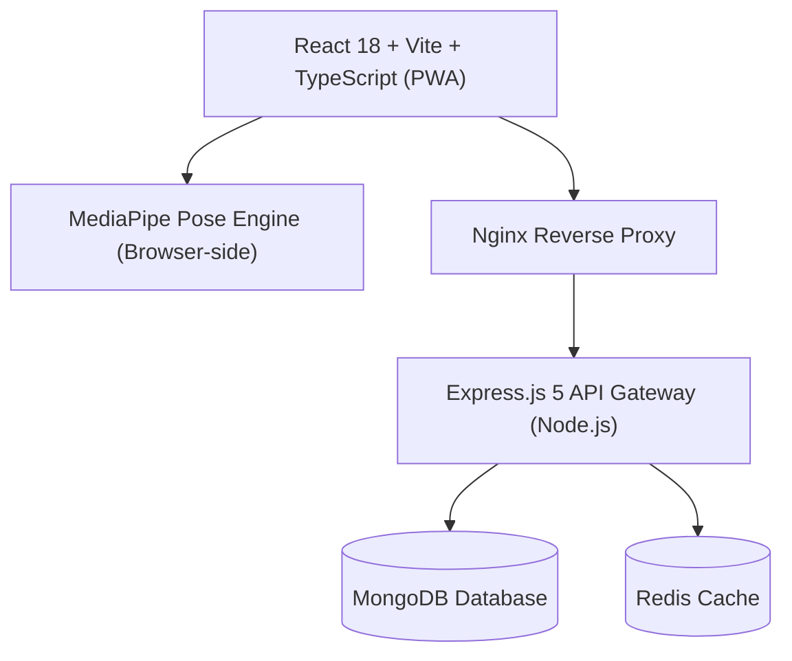

# 🏆 KreedAI — AI-Powered Athletic Performance & Scouting Platform

> **SIH Problem Statement:** SIH25073  
> **Tagline:** Empowering athletes with computer vision-driven physical assessments, digital sports passports, and recruiter scouting networks.

---

## 📌 Overview

**KreedAI** is an advanced, AI-driven sports fitness assessment and talent identification ecosystem. Built for athletes, coaches, and sports recruiters, KreedAI turns any smartphone or web camera into a high-precision biomechanical laboratory.

Using **MediaPipe Pose Estimation** directly in the browser, KreedAI measures athletic metrics—such as joint angles, movement speed, vertical jump height, stance stability, and form accuracy—without requiring expensive wearable hardware or sensors.

---

## ✨ Key Features

### 🏋️ 1. Real-time AI Movement & Biomechanics Assessment
- **General Fitness**: Push-ups, Squats, Bicep Curls (Rep counting, joint depth, tempo analysis).
- **Basketball Analytics**: Shooting Form, Vertical Jump, Lateral Movement, Defensive Stance, Sprint, Agility.
- **Boxing Diagnostics**: Punch Speed, Reaction Time, Guard Position, Footwork, Hip Rotation, Stance.
- **Weightlifting Biomechanics**: Bar Path Tracking, Joint Angles, Squat Depth, Lifting Technique, Stability, Tempo.
- **Live Cues & Audio Feedback**: Visual landmark overlays and real-time audio beep indicators.

### 📐 2. Smart Camera Calibration
- Interactive calibration flow to ensure camera distance, angle, tilt, lighting, and positioning are optimal before taking tests.

### 🎫 3. Digital Sports Passport
- Verified athletic identity document displaying verified assessment scores, radar chart analytics, badges, and QR verification.
- Export options available in **PDF** and **Image** formats for easy sharing with scouts.

### 📊 4. Athlete Dashboard & Progress Tracking
- Analytics dashboard featuring performance progress graphs, personal best records (PRs), and historical test history stored securely with offline support.

### 🏅 5. Leaderboards & Gamification
- Global, sport-specific, and regional leaderboards promoting competitive engagement and talent discovery.

### 🔎 6. Recruiter & Scout Dashboard
- Dedicated portal for sports academies and recruiters to discover, filter, compare, and connect with top-performing athletes based on verified data.

### 🌐 7. PWA & Offline Support
- Progressive Web App capability with offline storage (IndexedDB), custom install prompts, and update management for low-connectivity environments.

### 🌐 8. Multi-Language Support
- Built-in internationalization (i18n) context allowing easy switching across multiple regional and global languages.

---

## 🛠️ Architecture & Tech Stack



| Layer | Technologies Used |
| :--- | :--- |
| **Frontend** | React 18, TypeScript, Vite, React Router v6, `@mediapipe/pose`, Lucide React, HTML2Canvas, jsPDF |
| **Backend** | Node.js, Express.js 5, Mongoose (MongoDB), Redis, Zod, JWT, BcryptJS, Winston Logger |
| **Authentication** | JWT Access & Refresh Tokens, Cookie Parser, Google OAuth 2.0, OTP & Email verification |
| **DevOps & Infra** | Docker, Docker Compose, Nginx Alpine |

---

## 📁 Repository Structure

```
sih25073/
├── backend/
│   ├── src/
│   │   ├── config/          # DB, CORS, & App configs
│   │   ├── controller/      # Auth, Assessment, Leaderboard, Recruiter controllers
│   │   ├── middleware/      # Rate limiter, auth guards, error handlers, loggers
│   │   ├── model/           # Mongoose schemas (User, Assessment)
│   │   ├── routes/          # Express route definitions
│   │   └── utils/           # Email, JWT, and helper utilities
│   ├── app.js               # Express application configuration
│   ├── server.js            # Server entrypoint
│   └── package.json
├── client/
│   ├── src/
│   │   ├── components/      # UI components (Navbar, MobileNav, Auth, PWA)
│   │   ├── context/         # Auth, Language, PWA contexts
│   │   ├── mediapipe/       # Pose detection logic, angle calculations, sport modules
│   │   ├── pages/           # Assessment, Dashboard, Passport, Leaderboard, etc.
│   │   ├── services/        # API service clients
│   │   └── storage/         # IndexedDB offline storage handlers
│   ├── index.html
│   ├── vite.config.ts
│   └── package.json
├── nginx/
│   └── nginx.conf           # Reverse proxy configuration
├── Dockerfile               # Multi-stage production build configuration
├── docker-compose.yml       # Docker compose setup
└── package.json             # Root scripts wrapper
```

---

## ⚡ Quick Start & Installation

### Prerequisites
- **Node.js**: `v18.x` or higher
- **MongoDB**: Running instance locally or via MongoDB Atlas
- **Redis**: Running instance (optional, for session caching)
- **Docker & Docker Compose** *(optional for containerized deployment)*

---

### 🚀 Running Locally (Development Mode)

1. **Clone the Repository**:
   ```bash
   git clone https://github.com/nieo36/sih25073.git
   cd sih25073
   ```

2. **Install Dependencies**:
   ```bash
   # Install dependencies for both backend and client
   npm run install-services
   ```

3. **Configure Environment Variables**:

   **Backend (`backend/.env`)**:
   ```env
   PORT=2000
   HOST=0.0.0.0
   APP_URL=http://localhost:2000
   MONGO_URI=mongodb://localhost:27017/kreedai
   JWT_ACCESS_SECRET=your_access_token_secret
   JWT_REFRESH_SECRET=your_refresh_token_secret
   JWT_EMAIL_SECRET=your_email_secret
   SMTP_USER=your_email@gmail.com
   SMTP_PASS=your_email_app_password
   GOOGLE_CLIENT_ID=your_google_client_id
   GOOGLE_CLIENT_SECRET=your_google_client_secret
   CLIENT_URL=http://localhost:5173
   ```

   **Client (`client/.env`)**:
   ```env
   VITE_API_URL=http://localhost:2000/api/v1
   ```

4. **Start Development Servers**:

   - **Backend**:
     ```bash
     cd backend
     npm start
     ```

   - **Frontend**:
     ```bash
     cd client
     npm run dev
     ```

   Access the web app at `http://localhost:5173`.

---

### 🐳 Running with Docker

You can run the full stack (App + Nginx) via Docker Compose:

```bash
docker-compose up --build -d
```

The application will be accessible at `http://localhost:80`.

---

## 📜 Available Scripts

From the root directory:

| Script | Description |
| :--- | :--- |
| `npm run install-services` | Installs NPM dependencies in both `backend/` and `client/` |
| `npm run client:dev` | Launches Vite frontend development server |
| `npm run client:build` | Compiles TypeScript and builds production client assets |
| `npm run build` | Builds client assets directly into backend's public static folder |
| `npm start` | Launches Node.js production backend server |

---

## 🔒 Security & Best Practices

- **Sanitization & Validation**: All inputs validated using Zod schemas.
- **Auth Tokens**: HTTP-only secure cookies for refresh tokens + JWT access tokens.
- **Rate Limiting**: Protection against brute-force authentication and API abuse.
- **Security Headers**: Standard security headers configured via Helmet.

---

## 🤝 Contributing

Contributions are welcome!
1. Fork the project.
2. Create your Feature Branch (`git checkout -b feature/AmazingFeature`).
3. Commit your changes (`git commit -m 'Add some AmazingFeature'`).
4. Push to the Branch (`git push origin feature/AmazingFeature`).
5. Open a Pull Request.

---

## 📄 License

This project is licensed under the [ISC License](LICENSE).
